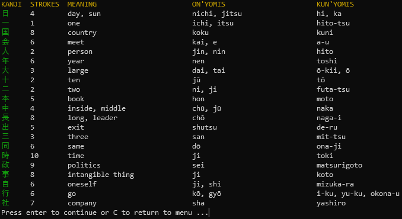
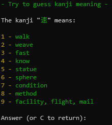

# LEARN JAPANESE

Simple terminal application to learn japanese

## Features
- List all kanjis sorted by grade and frequency
- Try to guess the kanji by its meaning or drawing

## Todo

These are the up coming features:
- [ ] Katakana
- [ ] Hiragana
- [ ] Search kanji

## Screenshots

## License

Fell free to use the code as you want.
